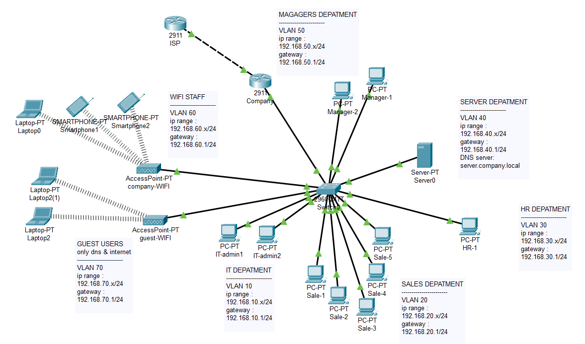
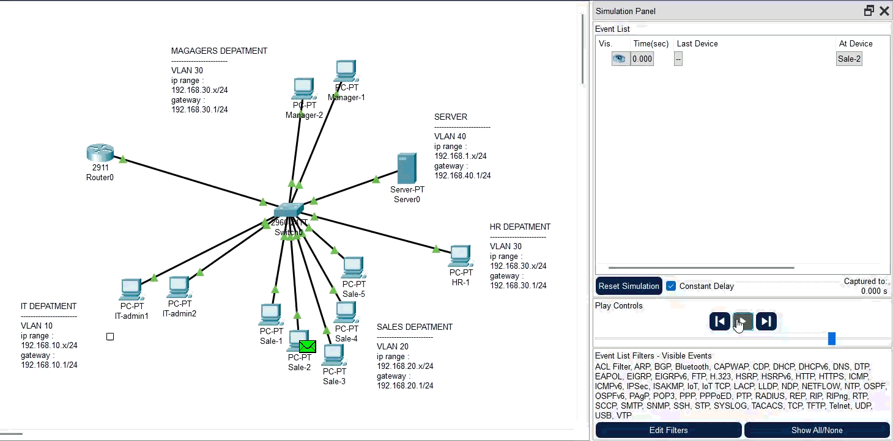
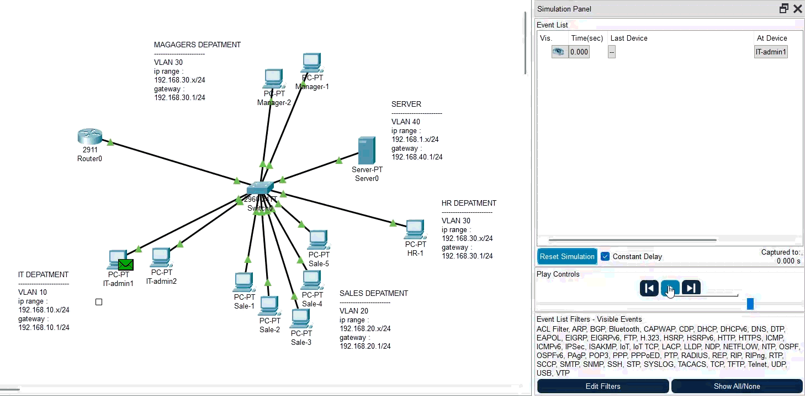

# Cisco Small Business Network

Designed and implemented a small business network in Cisco Packet Tracer using VLANs, 802.1Q trunking, and inter-VLAN routing.
> **Project Status:** Phase 1 — Internal Network ✅ Completed

---

## 📌 Project Overview

ABC Company requires a structured and segmented internal network for different departments.

The network is divided into multiple VLANs to provide:

- Logical network segmentation
- Reduced broadcast domains
- Department isolation
- Better network organization
- Inter-VLAN communication through Layer 3 routing

The current implementation uses a **Cisco Switch** and **Cisco Router** with a **Router-on-a-Stick** architecture.

---

## 🏗️ Network Topology



---

## 🧩 VLAN Design

| VLAN ID | Department | Network | Default Gateway |
|--------:|------------|---------|-----------------|
| 10 | IT | `192.168.10.0/24` | `192.168.10.1` |
| 20 | Sales | `192.168.20.0/24` | `192.168.20.1` |
| 30 | HR | `192.168.30.0/24` | `192.168.30.1` |
| 40 | Servers | `192.168.40.0/24` | `192.168.40.1` |
| 50 | Management | `192.168.50.0/24` | `192.168.50.1` |


---

## 💻 End Devices

### IT — VLAN 10

| Device | IP Address |
|--------|------------|
| IT-PC-01 | `192.168.10.10` |
| IT-PC-02 | `192.168.10.11` |

### Sales — VLAN 20

| Device | IP Address |
|--------|------------|
| Sales-PC-01 | `192.168.20.20` |
| Sales-PC-02 | `192.168.20.21` |
| Sales-PC-03 | `192.168.20.22` |
| Sales-PC-04 | `192.168.20.23` |
| Sales-PC-05 | `192.168.20.24` |

### HR — VLAN 30

| Device | IP Address |
|--------|------------|
| HR-PC-01 | `192.168.30.30` |

### Servers — VLAN 40

| Device | IP Address |
|--------|------------|
| Server-01 | `192.168.1.1` |

### Management — VLAN 50

| Device | IP Address |
|--------|------------|
| Manager-PC-01 | `192.168.50.40` |
| Manager-PC-02 | `192.168.50.41` |

---

# ⚙️ Technologies & Concepts

The following networking concepts are implemented in the current phase:

- IPv4 Addressing
- Subnetting
- VLANs
- Layer-2 Switching 
- Layer-3 Routing 
- Access Ports
- 802.1Q Trunking
- Router-on-a-Stick
- Router Subinterfaces
- Inter-VLAN Routing
- Default Gateways
- ICMP / Ping Testing
- Cisco IOS CLI
- Cisco Packet Tracer

---

# 🔧 Implementation

## 1. VLAN Configuration

VLANs were created on the switch to logically separate different departments.

Example:

```cisco
enable
configure terminal

vlan 10
name IT

vlan 20
name SALES

vlan 30
name HR

vlan 40
name SERVERS

vlan 50
name MANAGEMENT
```

---

## 2. Access Port Configuration

End-device ports were assigned to their corresponding VLANs.

Example:

```cisco
interface gigabitEthernet 0/2
switchport mode access
switchport access vlan 10
```

This assigns the interface to VLAN 10.

---

## 3. Trunk Configuration

The connection between the switch and router is configured as an **802.1Q trunk**.

```cisco
interface gigabitEthernet 0/1
switchport mode trunk
```

The trunk allows traffic from multiple VLANs to travel over a single physical link.

---

## 4. Router-on-a-Stick

A single physical router interface is divided into multiple logical subinterfaces.

Example for VLAN 10:

```cisco
interface gigabitEthernet 0/0.10
encapsulation dot1Q 10
ip address 192.168.10.1 255.255.255.0
```

The same architecture is used for the other VLANs:

```text
G0/0.10 → VLAN 10 → 192.168.10.1
G0/0.20 → VLAN 20 → 192.168.20.1
G0/0.30 → VLAN 30 → 192.168.30.1
G0/0.40 → VLAN 40 → 192.168.40.1
G0/0.50 → VLAN 50 → 192.168.50.1
```

---

# 🔀 Inter-VLAN Routing

Before implementing routing, each VLAN was isolated from the others.

For example:

```text
VLAN 10 (IT)
      X
VLAN 20 (Sales)
```

After configuring Router-on-a-Stick, the router provides Layer 3 communication between the VLANs.

Example:

```text
IT PC
192.168.10.10
      │
      ▼
192.168.10.1
      │
   Router
      │
192.168.20.1
      │
      ▼
Sales PC
192.168.20.20
```

This allows devices in different VLANs to communicate through the router.

---


# 🧪 Network Testing

Connectivity was verified using ICMP/Ping tests.

### Gateway Tests

```text
IT PC → 192.168.10.1       ✅
Sales PC → 192.168.20.1    ✅
HR PC → 192.168.30.1       ✅
Server → 192.168.40.1      ✅
Management → 192.168.50.1  ✅
```

### Inter-VLAN Tests

```text
IT → Sales          ✅
IT → HR             ✅
IT → Server         ✅
IT → Management     ✅
```

The successful tests confirm that:

- VLANs are correctly assigned
- The trunk link is functioning
- Router subinterfaces are operational
- Default gateways are correctly configured
- Inter-VLAN routing is working

---

# 📁 Project Structure

```text
cisco-small-business-network/
│
├── README.md
│
├── topology/
│   └── abc-network-topology.png
│
├── packet-tracer/
│   └── ABC-Small-Business-Network.pkt
│
├── documentation/
│   ├── vlan-table.md
│   ├── ip-addressing.md
│   └── configuration.md
│
└── screenshots/
    ├── topology.png
    ├── vlan-configuration.png
    ├── trunk-configuration.png
    ├── router-configuration.png
    └── connectivity-tests.png
```

---

# 🚧 Future Improvements

The project will be extended with additional network services and security features.

### Phase 2 — Network Services

- [ ] DHCP Server
- [ ] DHCP Relay / `ip helper-address`
- [ ] DNS Server

### Phase 3 — Internet Connectivity

- [ ] ISP Router
- [ ] Default Route
- [ ] NAT/PAT
- [ ] Internet simulation
- [ ] End-to-end connectivity testing

### Phase 4 — Network Security

- [ ] Standard ACLs
- [ ] Extended ACLs
- [ ] VLAN access restrictions
- [ ] Guest network isolation
- [ ] Server access policies

### Phase 5 — Documentation & Validation

- [ ] Network troubleshooting tests
- [ ] Failure scenarios
- [ ] Configuration backup
- [ ] Final network documentation

---

# 🎯 Learning Objectives

This project was built to gain practical experience with:

- Cisco IOS CLI
- Network segmentation
- VLAN architecture
- Layer 2 switching
- Layer 3 routing
- 802.1Q trunking
- Router-on-a-Stick
- IP addressing and subnetting
- Network troubleshooting
- Basic enterprise network design

---

# 🛠️ Tools

- **Cisco Packet Tracer**
- **Cisco IOS CLI**

---

# 📌 Project Status

| Component | Status |
|-----------|--------|
| VLANs | ✅ Completed |
| Access Ports | ✅ Completed |
| IP Addressing | ✅ Completed |
| Trunking | ✅ Completed |
| Router-on-a-Stick | ✅ Completed |
| Inter-VLAN Routing | ✅ Completed |
| DHCP | ⏳ Planned |
| DNS | ⏳ Planned |
| NAT/PAT | ⏳ Planned |
| Internet Access | ⏳ Planned |
| ACL | ⏳ Planned |

---

## 👤 Author

**Mohammad Momeni**

Computer Engineering / Software

Interested in Networking, Network Support, Software Development and Infrastructure.
